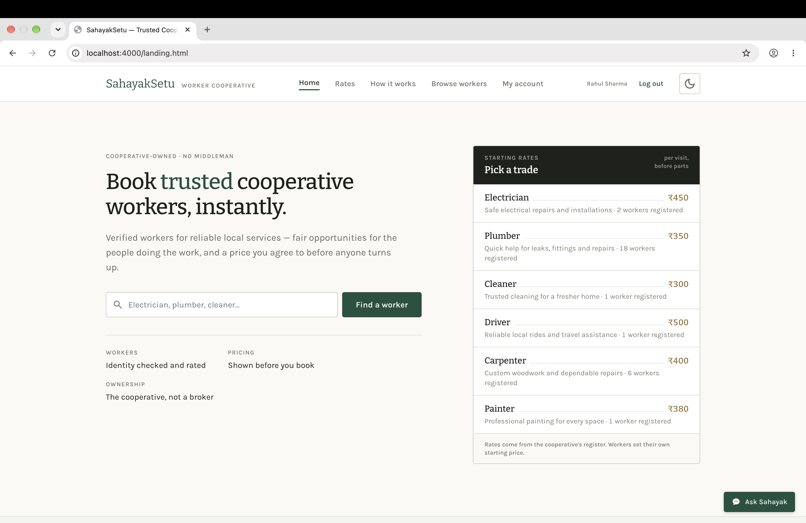
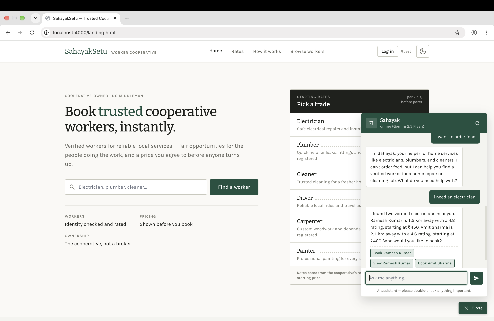
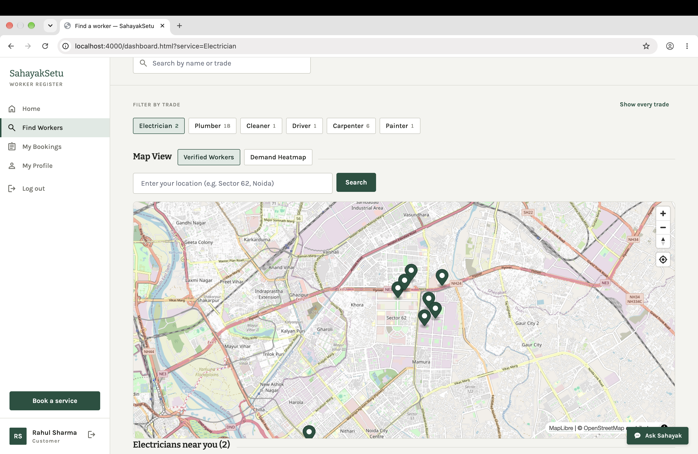
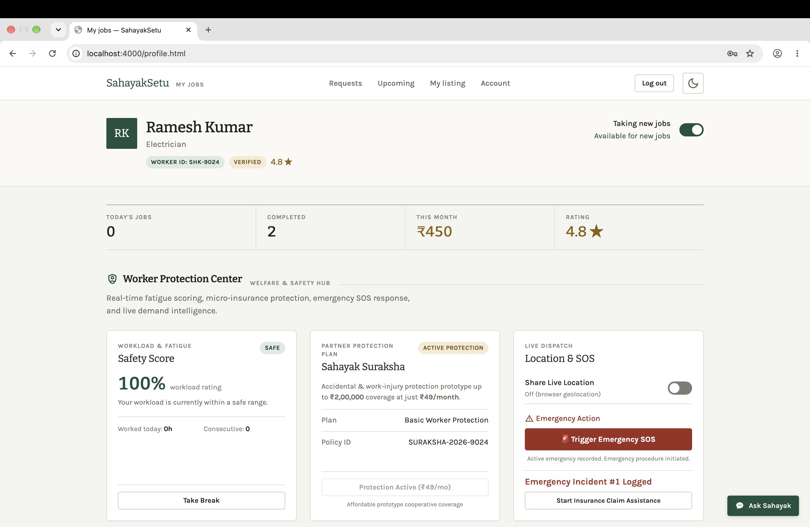
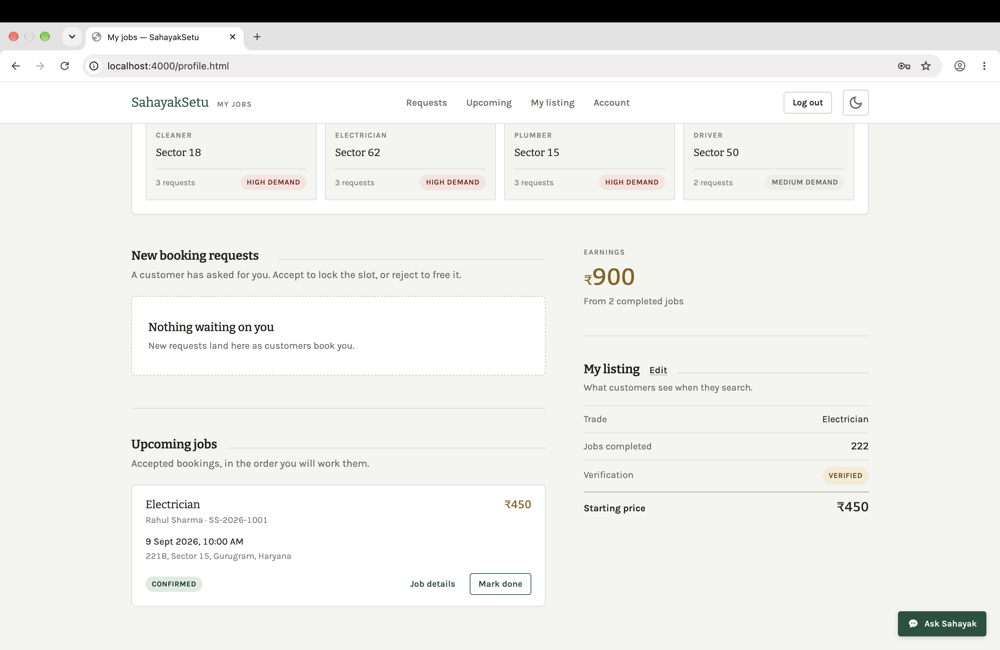
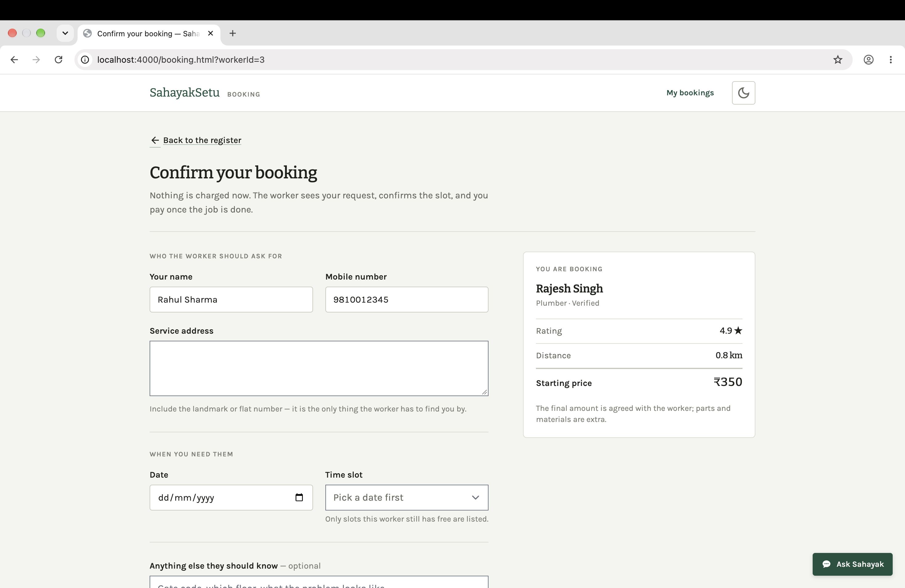

# Sahayak Setu (सहायक सेतु)

### Intelligent Fair-Trade Worker Service & Safety Ecosystem


---

## 📖 Overview

**Sahayak Setu** is an AI-powered cooperative service marketplace that connects verified local workers—including electricians, plumbers, carpenters, painters, cleaners, and drivers—with customers through a transparent and fair-trade ecosystem.

The platform combines **Gemini 2.5 Flash**, live worker tracking, secure booking, complaint heatmaps, worker safety monitoring, and micro-insurance to improve both customer experience and worker welfare.

---

## 📸 Screenshots

### Home Page



### AI Assistant (Gemini 2.5 Flash)



### Live Worker Tracking



### Worker Protection Center



### Worker Profile



### Booking Page



---

## ✨ Key Features

### 🤖 Gemini 2.5 Flash AI Assistant

- Powered by the official Google Gen AI SDK (`@google/genai`)
- Database-grounded responses through secure backend tools
- English, Hindi & Hinglish support
- Interactive booking assistance
- Offline fallback assistant

### 📍 Live Worker Tracking

- Real-time GPS location sharing
- ETA calculation using OSRM
- Secure customer access for confirmed bookings
- Interactive MapLibre route visualization

### 🗺️ Complaint & Demand Heatmap

- GeoJSON-powered demand visualization
- Trade-wise filtering
- Service hotspot analytics

### 🛡️ Worker Protection Center

- Worker fatigue score monitoring
- Break management system
- Emergency SOS workflow
- Suraksha micro-insurance enrollment

---

## 🏗️ Tech Stack

| Layer | Technology |
|--------|------------|
| Frontend | HTML5, CSS3, JavaScript |
| Backend | Node.js, Express.js |
| Database | SQLite (`better-sqlite3`) |
| Authentication | JWT |
| AI | Gemini 2.5 Flash |
| Maps | MapLibre GL JS + OpenStreetMap |
| Routing | OSRM |

---

## 🚀 Installation

### Clone Repository

```bash
git clone https://github.com/sumitmehta5836/Sahayak-Setu.git
cd Sahayak-Setu/server
```

### Install Dependencies

```bash
npm install
```

### Configure Environment

Create a `.env` file inside the `server` folder.

```env
PORT=4000
JWT_SECRET=your_long_random_secret

GEMINI_API_KEY=your_gemini_api_key
GEMINI_MODEL=gemini-2.5-flash
```

### Start the Application

```bash
npm run reset
npm start
```

Open:

```text
http://localhost:4000
```

---

## 🔑 Demo Accounts

| Role | Email | Password |
|------|-------|----------|
| Customer | `customer@demo.com` | `demo1234` |
| Worker | `worker@demo.com` | `demo1234` |
| Admin | `admin@demo.com` | `demo1234` |

---

## 🧪 Testing

Run backend integration tests:

```bash
cd server
npm test
```

---

## 🔒 Security

- Server-side Gemini API isolation
- JWT authentication with role-based access control
- Parameterized SQLite queries
- Protected worker location access
- Password hashing using `bcryptjs`

---

## 🌟 Project Highlights

- AI-powered cooperative gig marketplace
- Live worker tracking with interactive maps
- Worker safety & fatigue management
- Emergency SOS and micro-insurance prototype
- Secure booking system with role-based authentication
- Responsive full-stack web application built using Node.js & Express

---

## 👨‍💻 Author

**Sumit Mehta**

B.Tech Computer Science Engineering

Graphic Era Hill University

---

## 📄 License

Developed for educational and cooperative empowerment purposes.
